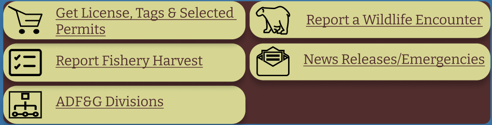

# Assignment-07
## Project Description 
My project looks to analyze and change the design of Alaska's Department of Fish and Game Website in order to make tasks such as finding bear viewing locations and submitting a Wildlife Encounter Report Form easier. The purpose of this prototype assignment is to visualize the webpages information and interactive components with a limited screen size in order to understand the tradeoffs of alternative design features, and to validify the interaction flow that the users choice will branch out. In order to do this I must first add graphic components to my wireframes and add interactivity to test the graphical and operational consistency of the pages which ultimately make up the prototypes flow. Then, I have to have others test out the interactive prototype to determine whether or not the user can easily carry out tasks within the system. Lastly, once this is complete I must self-evaluate the design to smooth out any interactions or designs that might stump the user in the process of carrying out given tasks.

## Tasks
The following prototype will illustrate how one can find locations at which bears typically reside in as well as the best times of the year to view them. This tasks will be carried out by utilizing the site navigation tab and clicking on the viewing tab to see what wild animals are available to view out in Alaska. The user will then click on the black and brown bear category to see where they might see them. 

The second tasks this prototype illustrates is submitting a Wildlife Encounter Report Form. To do this users must click on the Wildlife Encounter Report Form button found on the home page, which then leads them to the form. Then, since the tester is not able to type on the prototype they will pretend to fill the form out and then submit the form which will lead them to a new page where they can either go back to the form or to the home page. 

## Image of Wireframe with Interface Design
 </a> 
This is the small frame prototype I have developed from the much larger desktop prototype I originally created in the low fidelity prototype. After conducting usability testing on the prototype I found that seamlessness and efficiency were the users main issues when trying to complete the tasks. Which is why for this prototype I made clickable buttons and information pages more direct. Additionally, I made categories and information on the home screen more concise by having pictures and titles represent the information it held, this should hopefully allow users to more easily and efficiently find what they are looking for. When it came to Wildlife Encounter Report Form I minimized the amount of information needed to be filled out and I added an automatic location pin button in case the user was not sure of the exact location they were at. I also slightly adjusted the colors so that all color contrast checks were passed. 

## Image of Wireflow 
 </a>

## Prototype 
Link to Interactive prototype can be found <a href="https://www.figma.com/proto/xcE8uYadsSKRI0JRrVU0fS/Interface-Design?node-id=46%3A2&scaling=min-zoom&page-id=0%3A1&starting-point-node-id=46%3A2"> here </a>

## Cognitive Walkthroughs
Link to videos of Cognitive Walkthroughs can be found here: <a href="https://drive.google.com/file/d/1u_ayqGoPtyN8zySBJMLq1_wC0oILzr5Z/view?usp=sharing"> 1st Cognitive Walkthrough </a>, <a href="https://drive.google.com/file/d/1shIppbjdj-xqDHhLBfVKxyz8RsZFko9p/view?usp=sharing"> 2nd Cognitive Walkthrough </a>, <a href="https://drive.google.com/file/d/1icvw1uvC-fiNhn4gvR2xa2siNPW1pohR/view?usp=sharing"> 3rd Cognitive Walkthrough </a>

## Feedback
After conducting a cognitive Walkthrough with the first user it seemed like the button icons on the home page were not uniform and seemed a little out of place, also the social media/media icons at the bottom of the pages were said to not represent them properly, and lastly one person said that there should be a type in feature for describing the encounter scene with the wildlife animal. Furthermore, in the second cognitive walkthrough the user was not very verbal in describing ways the design system could be improved however based on his mouse clicks it seemed like it was confusing as to how to get back to the homepage. He kept clicking on the departments logo and name to try to go back instead of clicking the home button at the top right of the screen, so in the interactivity design I will make sure to make the departments logo and name clickable. Lastly, the last user I conducted a cognitive walkthrough with gave me some critical feedback telling me that the home page is still not minimal enough, suggesting I combine categories to create less of a load on the home page, which is something I will explore further in the next revision. Additionally, he suggested emphasizing the “back” button more when going through the different pages, to make it easier for the user to navigate back and forth between pages. 

## Revised Interface Designs

 

